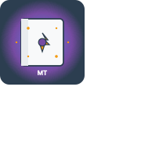

# Mystical Teachings 🃏

A Progressive Web App for searching Magic: The Gathering cards using the comprehensive Scryfall database. Optimized for iOS devices with offline support and a native-like experience.



## ✨ Features

- **🔍 Real-time Card Search**: Search thousands of Magic cards by name with instant suggestions
- **📱 PWA Ready**: Install on your iOS device for native app-like experience
- **💾 Offline Support**: View previously searched cards even without internet
- **❤️ Favorites System**: Save your favorite cards for quick access
- **📚 Search History**: Keep track of your recent searches
- **🎨 Responsive Design**: Optimized for both iPhone and iPad
- **♿ Accessible**: Full screen reader and keyboard navigation support
- **⚡ Fast Performance**: Intelligent caching and optimized loading

## 🚀 Quick Start

1. **Clone the repository**
   ```bash
   git clone <repository-url>
   cd MysticalTeachings
   ```

2. **Open the app**
   - Simply open `index.html` in your web browser
   - Or serve with a local web server for full PWA features:
   ```bash
   python3 -m http.server 8000
   # Then visit http://localhost:8000
   ```

3. **Install as PWA (iOS)**
   - Open in Safari on your iOS device
   - Tap the Share button
   - Select "Add to Home Screen"
   - Enjoy the native app experience!

## 📖 How to Use

### Search for Cards
1. Navigate to the **Search** tab
2. Type any Magic card name in the search box
3. Browse search suggestions or hit Enter to search
4. Tap any card to view detailed information
5. Use the heart icon to add cards to favorites

### Manage Favorites
1. Go to the **History** tab
2. View your favorite cards in the top section
3. Tap any favorite to view details
4. Remove from favorites using the heart icon

### Browse History
1. Visit the **History** tab
2. See your recent searches in the bottom section
3. Tap any search to repeat it quickly

## 🛠️ Technology Stack

- **Frontend**: Vanilla HTML5, CSS3, JavaScript (ES6+)
- **API**: [Scryfall API](https://scryfall.com/docs/api) for card data
- **PWA**: Service Workers, Web App Manifest
- **Storage**: LocalStorage for offline data
- **Design**: Mobile-first responsive design with iOS optimizations

## 📁 Project Structure

```
MysticalTeachings/
├── index.html              # Main application entry point
├── manifest.json          # PWA configuration
├── sw.js                  # Service worker for offline support
├── icon.jpg               # App icon (180x180)
├── css/
│   ├── styles.css         # Main application styles
│   ├── cards.css          # Card display and grid styles
│   └── mana-symbols.css   # MTG mana symbol styling
├── js/
│   ├── app.js             # Main application controller
│   ├── api.js             # Scryfall API integration
│   ├── cards.js           # Card search and display logic
│   └── storage.js         # Local storage management
├── spec.md                # Detailed technical specification
└── README.md              # This file
```

## 🔧 Configuration

The app works out of the box with no configuration needed. However, you can modify:

- **Cache duration**: Adjust cache times in `sw.js` and `api.js`
- **Search limits**: Modify result limits in `cards.js`
- **Styling**: Customize colors and layout in CSS files
- **Storage limits**: Adjust storage quotas in `storage.js`

## 🌐 API Usage

This app uses the [Scryfall API](https://scryfall.com/docs/api) to fetch card data:

- **Rate Limiting**: Respects 10 requests/second limit
- **Caching**: Intelligent caching reduces API calls
- **Error Handling**: Graceful fallbacks for API issues
- **Attribution**: Proper credit to Scryfall and Wizards of the Coast

## 📱 PWA Features

### Installation
- **iOS Safari**: Add to Home Screen support
- **Standalone Mode**: Launches without browser UI
- **Splash Screen**: Custom loading screen
- **App Icon**: High-quality 180x180 icon

### Offline Support
- **Service Worker**: Caches app shell and resources
- **Background Sync**: Queues requests when offline
- **Cache Strategy**: Network-first for fresh data, cache fallback
- **Storage Management**: Automatic cache cleanup

### Performance
- **Fast Loading**: Optimized assets and lazy loading
- **Smooth Animations**: 60fps transitions
- **Memory Efficient**: Smart cache management
- **Battery Friendly**: Optimized API usage

## 🎨 Design Features

### Mobile-First
- Touch-friendly 44px+ tap targets
- Optimized for thumb navigation
- Swipe and gesture support
- Safe area insets for notched devices

### Accessibility
- **WCAG 2.1 AA** compliant
- Screen reader announcements
- Keyboard navigation
- High contrast mode support
- Reduced motion preferences

### Visual Design
- **Material Design** inspired
- Clean, minimal interface
- MTG-themed color palette
- Responsive typography
- Dark/light mode support

## 🔍 Keyboard Shortcuts

- **Cmd/Ctrl + K**: Focus search input
- **Cmd/Ctrl + H**: Switch to History tab
- **Cmd/Ctrl + I**: Switch to About tab
- **Escape**: Close modals and clear focus
- **Arrow Keys**: Navigate search suggestions
- **Enter**: Confirm search or selection

## 🐛 Troubleshooting

### Common Issues

**Cards not loading:**
- Check internet connection
- Verify Scryfall API is accessible
- Clear browser cache if needed

**PWA not installing:**
- Use Safari on iOS (Chrome doesn't support iOS PWA installation)
- Ensure HTTPS or localhost
- Check browser compatibility

**Search not working:**
- Try shorter, simpler search terms
- Check for typos in card names
- Use partial names if exact match fails

### Browser Support

- **iOS Safari**: 14+ (recommended)
- **Chrome**: 80+ (limited PWA features on iOS)
- **Firefox**: 75+ (limited PWA features)
- **Edge**: 80+

## 🤝 Contributing

Contributions are welcome! Please feel free to:

1. **Report Issues**: Use GitHub issues for bugs
2. **Suggest Features**: Ideas for improvements
3. **Submit PRs**: Code contributions
4. **Improve Docs**: Help with documentation

### Development Setup

1. Fork the repository
2. Make your changes
3. Test thoroughly on iOS devices
4. Submit a pull request

## 📄 License

This project is licensed under the MIT License - see the [LICENSE](LICENSE) file for details.

## 🙏 Attribution

- **Card Data**: Provided by [Scryfall](https://scryfall.com)
- **Magic: The Gathering**: © Wizards of the Coast
- **Icons**: Custom designed for this app
- **Inspiration**: MTG community and deck builders

## 📧 Contact

For questions, suggestions, or support:

- **Issues**: Use GitHub Issues
- **Email**: [Your email if desired]
- **Twitter**: [Your Twitter if desired]

## 🔮 Future Enhancements

Planned features for future releases:

- **Advanced Search**: Filter by type, color, set, etc.
- **Deck Builder**: Create and manage card decks
- **Price Tracking**: Monitor card price changes
- **Collection Manager**: Track owned cards
- **Sharing**: Share cards and searches
- **Export**: Export favorites and decks
- **Push Notifications**: New set releases
- **Multi-language**: Support for other languages

---

**Mystical Teachings** - *Discover the magic in every card* ✨

Made with ❤️ for the Magic: The Gathering community